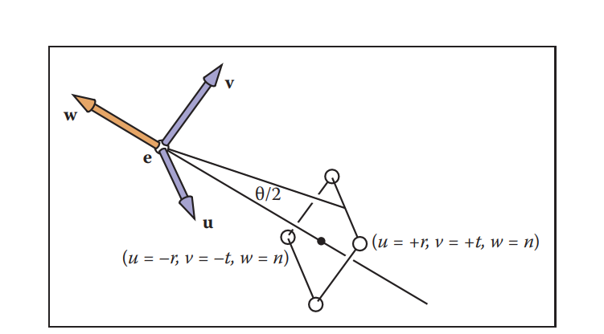

这一次作业比较简单

### get_model_matrix

这个函数就是返回绕z轴旋转的矩阵，比较简单，套公式

```cpp
    rotation_angle = rotation_angle / 180 * MY_PI;
    const double cosNum = cos(rotation_angle);
    const double sinNum = sin(rotation_angle);
    model << cosNum, -sinNum, 0, 0,
        sinNum, cosNum, 0, 0,
        0, 0, 1, 0,
        0, 0, 0, 1;
```

### get_projection_matrix

首先是透视投影的部分，直接套公式

```cpp
	// 注意输入是正的！
    zNear = -zNear; zFar = -zFar;
    projection << zNear, 0, 0, 0,
                    0, zNear, 0, 0,
                    0, 0, zNear + zFar, -zNear * zFar,
                    0, 0, 1, 0;
```

注意到，其实我们的投影公式只和近远两个平面相关


然后是正交投影的部分，注意这里引入`视场/视野 Field-of-View`的概念



有两个维度，视场角（fov）和纵横比

$ t = |n| * \tan(\theta/2)$

$\frac{r}{t} = AspectRatio$

带入正交投影公式，(r+l = 0,t+b = 0)可以得到
$$
M_{orth} = \begin{bmatrix}
\frac{2}{r-l}&0&0&-\frac{r+l}{r-l} \\
0&\frac{2}{t-b}&0&-\frac{t+b}{t-b} \\
0&0&\frac{2}{n-f}&-\frac{n+f}{n-f} \\
0&0&0&1 
\end{bmatrix} = \begin{bmatrix}
\frac{2}{r-l}&0&0&0 \\
0&\frac{2}{t-b}&0&0 \\
0&0&\frac{2}{n-f}&-\frac{n+f}{n-f} \\
0&0&0&1 
\end{bmatrix}
$$


然后手动乘一下：
$$
M_{orth} M_p = \begin{bmatrix}
\frac{2}{r-l}&0&0&0 \\
0&\frac{2}{t-b}&0&0 \\
0&0&\frac{2}{n-f}&-\frac{n+f}{n-f} \\
0&0&0&1 
\end{bmatrix} \begin{bmatrix}
n&0&0&0 \\
0&n&0&0 \\
0&0&n+f&-nf \\
0&0&1&0
\end{bmatrix} \\
=
\begin{bmatrix}
\frac{2n}{r-l}&0&0&0 \\
0&\frac{2n}{t-b}&0&0 \\
0&0&\frac{n+f}{n-f}&	\frac{-2nf}{n-f} \\
0&0&1&0 
\end{bmatrix}
$$
所以最后代码为：

```cpp
    eye_fov = eye_fov / 180 * MY_PI;
    const float h = 2 * zNear * tan(eye_fov / 2); // 这里应该是正！
    const float w = h / aspect_ratio;
    // 这里应该是负！
    zNear = -zNear; zFar = -zFar;
    projection << 2 * zNear / w, 0, 0, 0,
        0, 2 * zNear / h, 0, 0,
        0, 0, (zNear + zFar) / (zNear - zFar), -2 * zNear * zFar / (zNear - zFar),
        0, 0, 1, 0;

```

输出结果为


### 绕任意轴旋转

罗德里格旋转公式
$$
R(\vec{n},\alpha) = \cos(\alpha) \vec{I} + (1-\cos(\alpha)) \vec{n}\vec{n}^T + \sin(\alpha) \begin{bmatrix}
0 &-n_z &n_y \\
n_z &0&-n_x\\
-n_y&n_x&0 
\end{bmatrix}
$$

我还不会推（x