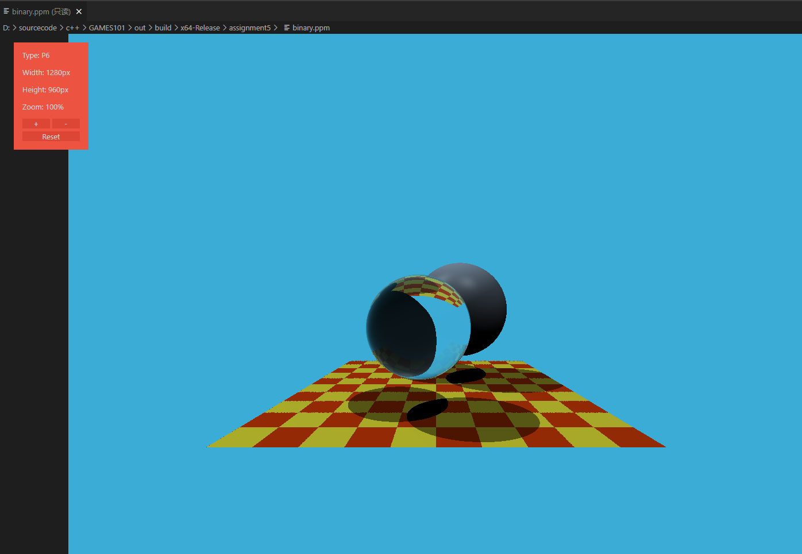

# ps5

这次的其实也非常简单

## 光线生成

`Renderer::Render` 函数里，我们要根据像素位置$(i,j)$，生成光线的方向

首先要明确一点，光线追踪是发生在世界坐标系里的，我们要把像素坐标转回世界坐标。

回忆一下世界坐标系到投影平面的坐标转换

$$\begin{bmatrix}\frac{2n}{r-l}&0&0&0 \\0&\frac{2n}{t-b}&0&0 \\0&0&\frac{n+f}{n-f}&	\frac{-2nf}{n-f} \\0&0&1&0 \end{bmatrix}$$

其中z不用管。n是投影平面的z坐标，框架默认的是我们从$(0,0,0)$ 看向 $(0,0,-1)$，所以这里n就是1。r-l是投影平面宽度w，t-b是投影平面高度h

需要注意的是，这里的w和高度h不是场景的宽高，我们是转到2*2，中心为(0,0)的NDC（标准屏幕空间的），$h = 2*|n|* \tan (fov/2) , w/h = AspectRatio, n = 1$

所以我们要把像素坐标转换为NDC坐标

$(x',y') = (\frac{2i}{width} - 1,\frac{2j}{height} - 1)$

然后再逆变换回世界坐标 

$(x,y) = (x' \frac{w}{2n},y' \frac{h}{2n})$

对应到代码里就是

```cpp
// 2 被消掉了
// 为什么y有个符号，貌似是因为图片左上角是（0，0），y轴朝下
dir = (x * imageAspectRatio * scale, - y * scale, -1)
```

## Moller-Trumbore 算法

抄书即可

## 结果查看

ppm在windows上不能直接打开，找了个vsc插件可以看

