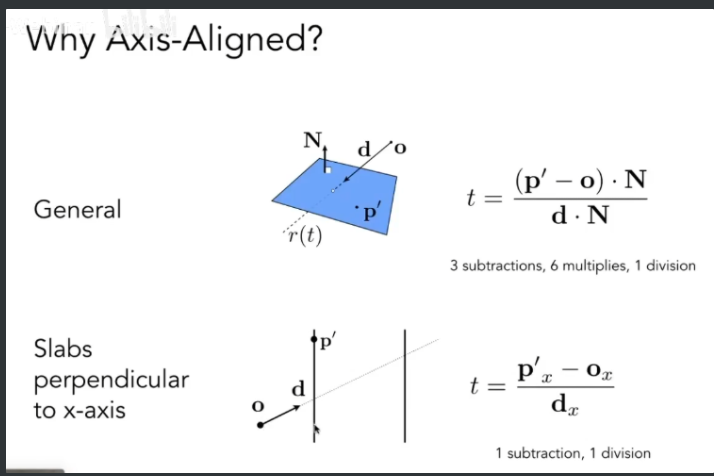
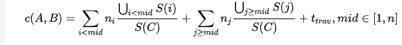
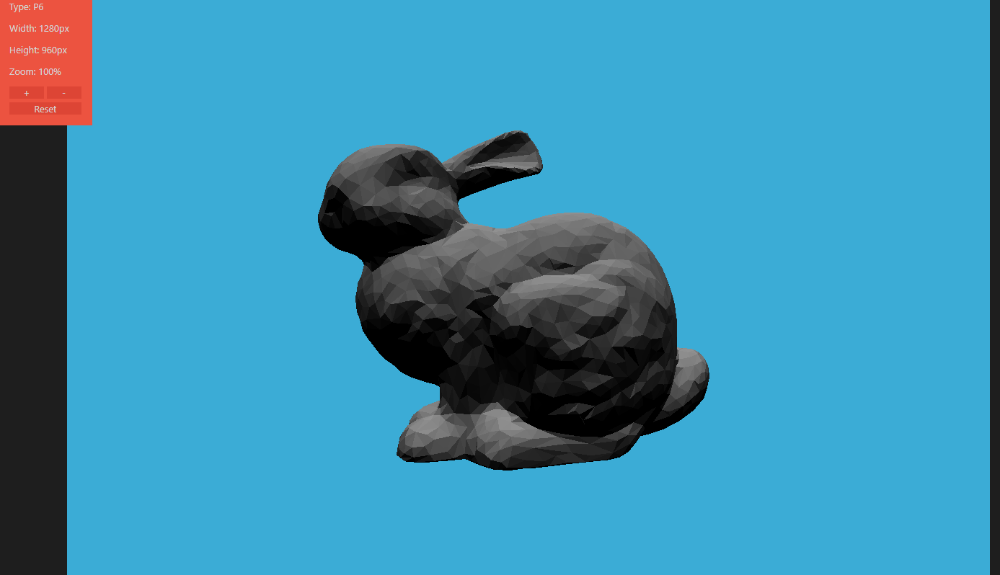

# ps6

这次的也不算难，甚至感觉光线追踪写起来比光栅化舒服，更像是一个算法实现，而不是矩阵运算。

## Render() in Renderer.cpp

基本照抄

比较疑惑的一点是方向还是按照（0,0，0）起算，事实上眼的位置不是

## Triangle::getIntersection

非常简单，把Intersection的几个值设置一下即可

## Intersection

非常简单，按照课上讲的算一下即可



注意代码里使用了dir inv,这样只用写乘法。但是他给的第三个参数没用啊……

## getIntersection

非常像树的遍历

```cpp
if (node == nullptr || !node->bounds.IntersectP(ray, ray.direction_inv, dirIsNeg))
    {
        return res;
    }
    if (node->left == nullptr && node->right == nullptr)
    {
        if (node->object != nullptr)
            res = node->object->getIntersection(ray);
        return res;
    }
    const auto l = getIntersection(node->left, ray);
    const auto r = getIntersection(node->right, ray);
    if (l.happened && l.distance < res.distance)
    {
        res = l;
    }
    if (r.happened && r.distance < res.distance)
    {
        return r;
    }
    return res;
```

## SAH

参考了知乎上一篇文章

PBRT-E4.3-层次包围体(BVH)（一） - 玉米的文章 - 知乎
https://zhuanlan.zhihu.com/p/50720158



cost的计算，算左右bucket包围盒的交集的面积

代码见`BVHAccel::recursiveBuildSAH`

使用需要在 `Scene::buildBVH` 把参数改成 `BVHAccel::SplitMethod::SAH`


效果图

